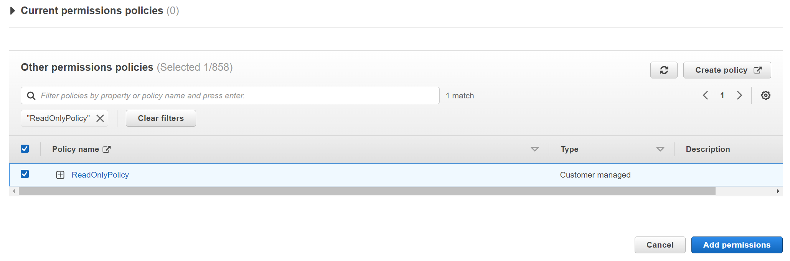
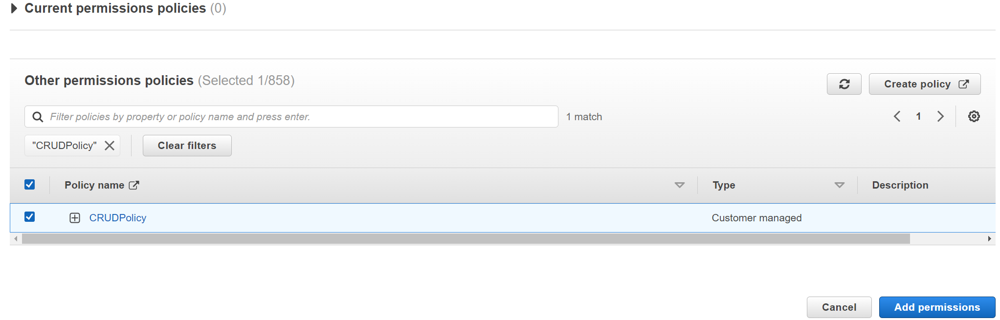
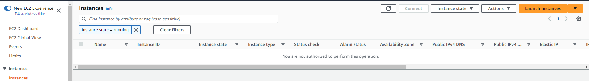
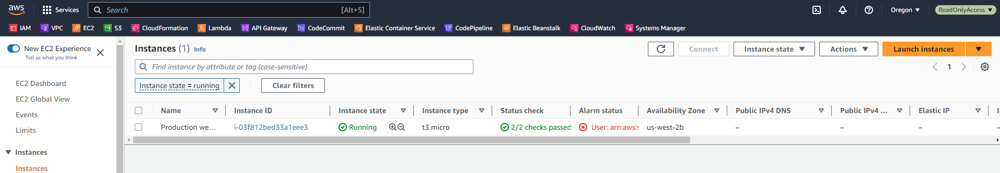
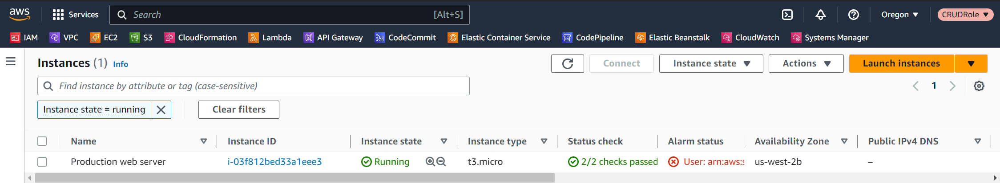

# Securing Resources Using AWS IAM


## 🔗 Contact Information
[](https://www.linkedin.com/in/alexnavarro2/)
[](https://mail.google.com/mail/u/0/#inbox?compose=GTvVlcSBpRjxKKJtxTLNxwpsKvpfbRSRnRLcTQRMZLcKCNfrJjXfcNNKPmstkbHJpzHGNZnHvhCph)

## Project Overview:
Demonstrate how to create policies that users assume when they need elevated priviledges. Using this method reduces the risk of users taking accidental actions because users have to explicity request elevated permissions to perform actions that alter the enviornment. This also creates an audit trail showing when elevated permissions were granted to users.

### AWS Identity and Access Management Documentation:
https://docs.aws.amazon.com/IAM/latest/UserGuide/introduction.html

## Explore Current IAM Users:
We can see that the user called IAMAdminUser has the "AdminstratorAccess" policy directly attached to the account


The IAMUser user doesn't have any admin access and has restricted permissions.


The following shows the Evaluation Logic for IAM Policies:


## Explore Current Roles:
There is four roles we will use:
* A user read-only role
* A user CRUD rule
* A EC2 read-only rule
* An Amazon EC2 CRUD rule.

The following is the policy attached to the UserReadOnlyRole:
```
{
    "Version": "2012-10-17",
    "Statement": [
        {
            "Action": [
                "ec2:DescribeRegions",
                "sts:AssumeRole"
            ],
            "Resource": "*",
            "Effect": "Allow"
        }
    ]
}
```
The role allows the following:
* ec2:DescribeRegions: This action allows the user to retrieve information about the available AWS regions.
* sts:AssumeRole: temporarily taking on the permissions and policies associated with that role. 

## AWS Resources to Provision:
* The following is the three-tier web application consisting of an Application Load Balancer, Auto Scaling Group, and an Amazon Aurora Cluster. These are the resources that will be used to verify that change roles have been granted different access using AWS STS.


## Creating Different Access Policies and Attaching them to Roles:
* First I will create a read-only policy and a CRUD policy to assign to applicable roles.
* This policy allows all "Describe" permissions for the EC2 Service.
```
{
    "Version": "2012-10-17",
    "Statement": [
        {
            "Sid": "DescribeProd",
            "Effect": "Allow",
            "Action": [
                "ec2:Describe*",
                "sts:AssumeRole"
            ],
            "Resource": "*"
        }
    ]
}
```
* Next create the CRUD policy
* The following policy allows basic Amazon EC2 CRUD and Amazon RDS read-only operations:
```
{
    "Version": "2012-10-17",
    "Statement": [
        {
            "Sid": "ManageProd",
            "Effect": "Allow",
            "Action": [
                "ec2:AuthorizeSecurityGroupEgress",
                "ec2:AuthorizeSecurityGroupIngress",
                "ec2:Describe*",
                "ec2:RevokeSecurityGroupEgress",
                "ec2:RevokeSecurityGroupIngress",
                "ec2:StopInstances",
                "ec2:TerminateInstances",
                "ec2:UpdateSecurityGroupRuleDescriptionsEgress",
                "ec2:UpdateSecurityGroupRuleDescriptionsIngress",
                "rds:Describe*",
                "sts:AssumeRole"
            ],
            "Resource": "*"
        }
    ]
}
```

## Attach Polices to Roles:
* Find the "UserReadOnlyRole"
* On the permissions tab, choose "Add Permissions" then attach the policy "ReadOnlyPolicy: 



* Repeat the same steps but this time attach the "CRUDPolicy" to the UserCRUDRole



## UPDATE TRUST RELATIONSHIPS FOR ROLES:
A trust relationship defines what entities are allowed to assume the roles. I will update the trust relationships for both the UserReadOnlyRole and UserCRUDRole roles, limiting access to a single user.

* Go to Roles
* Edit trust policy
```
{
  "Version": "2012-10-17",
  "Statement": [
    {
      "Effect": "Allow",
      "Principal": {
        "AWS": "arn:aws:iam::<AccountId>:user/IAMUser1-J2bkzZ"
      },
      "Action": "sts:AssumeRole"
    }
  ]
}
```

```
{
    "Version": "2012-10-17",
    "Statement": [
        {
            "Effect": "Allow",
            "Principal": {
                "AWS": "arn:aws:iam::<AccountId>:user/IAMUser1-J2bkzZ"
            },
            "Action": "sts:AssumeRole"
        }
    ]
}
```

## Assuming Roles:
When an IAM user logs into their account, they are granted permissions based on the policies directly attached to their account or if they're part of a group, they will have the policies that are applied to that group and then implemented onto their account. To increase security, the user can request short-term credentials that grant the user elevated permissions.

Right now I logged in as a different user and went to EC2. We can see that the user does not have access to view any of the running EC2 Instances.


## Switch to ReadOnlyAccess Role:
I will demonstrate how the user will have temporary credentials that allow read-only access to the specified services that I wrote in my policy above.

* Go to Switch Role on top right
* Enter Account ID
* Enter Password
* Display Name = ReadOnlyAccess
* Click Switch Role button

Now if I look at my EC2 instances, we can see that my role at the top right says "ReadOnlyAccess" and that I can now see the "Production web server" instance because my assumed role allows the 'ec2:Describe*' permission stated in my policy above.


If I repeat the process above, for the UserCRUDRole we can see that I also can elevate the permssions to have the ec2:Describe permission showing.



## How to revoke access:
Next, I'll deomonstrate how to revoke access to a role using conditional statements in policies.
