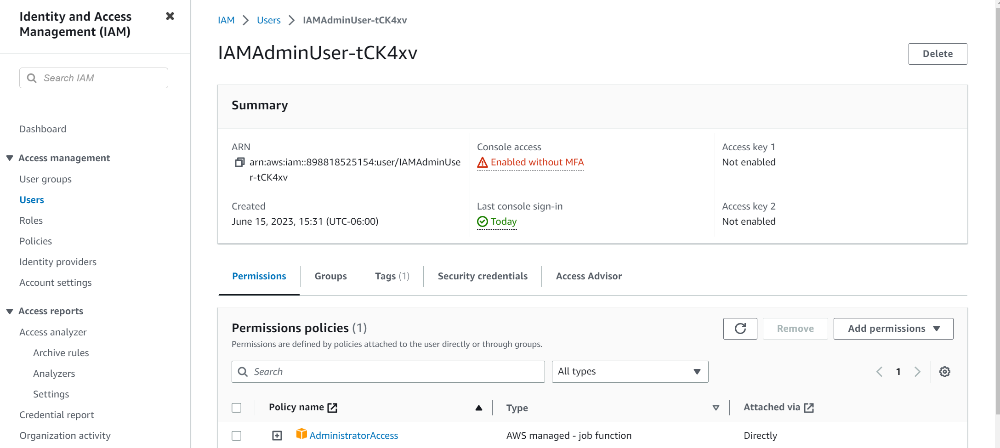
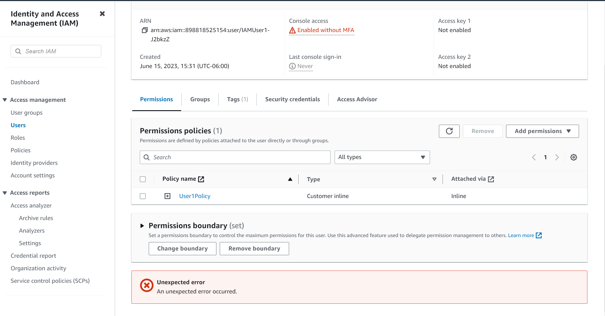
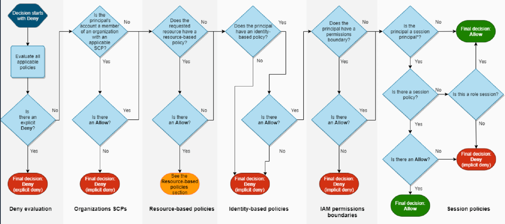
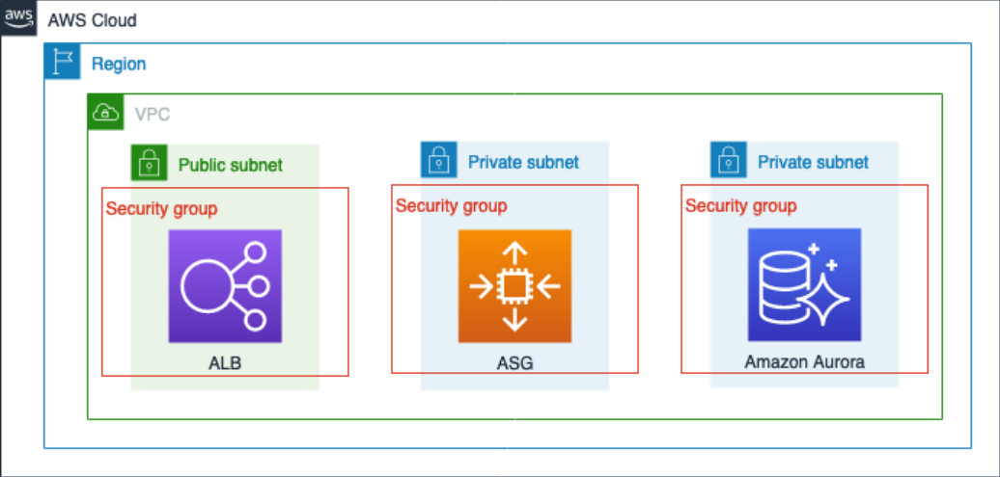

# Securing Resources Using AWS IAM


## 🔗 Contact Information
[](https://www.linkedin.com/in/alexnavarro2/)
[](https://mail.google.com/mail/u/0/#inbox?compose=GTvVlcSBpRjxKKJtxTLNxwpsKvpfbRSRnRLcTQRMZLcKCNfrJjXfcNNKPmstkbHJpzHGNZnHvhCph)

## Project Overview:
Demonstrate how to create policies that users assume when they need elevated priviledges. Using this method reduces the risk of users taking accidental actions because users have to explicity request elevated permissions to perform actions that alter the enviornment. This also creates an audit trail showing when elevated permissions were granted to users.

### AWS Identity and Access Management Documentation:
https://docs.aws.amazon.com/IAM/latest/UserGuide/introduction.html

## Explore Current IAM Users:
We can see that the user called IAMAdminUser has the "AdminstratorAccess" policy directly attached to the account



The IAMUser user doesn't have any admin access and has restricted permissions.



The following shows the Evaluation Logic for IAM Policies:


## Explore Current Roles:
There is four roles we will use:
* A user read-only role
* A user CRUD rule
* A EC2 read-only rule
* An Amazon EC2 CRUD rule.

The following is the policy attached to the UserReadOnlyRole:
```
{
    "Version": "2012-10-17",
    "Statement": [
        {
            "Action": [
                "ec2:DescribeRegions",
                "sts:AssumeRole"
            ],
            "Resource": "*",
            "Effect": "Allow"
        }
    ]
}
```
The role allows the following:
* ec2:DescribeRegions: This action allows the user to retrieve information about the available AWS regions.
* sts:AssumeRole: temporarily taking on the permissions and policies associated with that role. 

## AWS Resources to Provision:
* The following is the three-tier web application consisting of an Application Load Balancer, Auto Scaling Group, and an Amazon Aurora Cluster. These are the resources that will be used to verify that change roles have been granted different access using AWS STS.



## Creating Different Access Policies and Attaching them to Roles:
* First I will create a read-only policy and a CRUD policy to assign to applicable roles.
* This policy allows all "Describe" permissions for the EC2 Service.
```
{
    "Version": "2012-10-17",
    "Statement": [
        {
            "Sid": "DescribeProd",
            "Effect": "Allow",
            "Action": [
                "ec2:Describe*",
                "sts:AssumeRole"
            ],
            "Resource": "*"
        }
    ]
}
```
* Next create the CRUD policy
* The following policy allows basic Amazon EC2 CRUD and Amazon RDS read-only operations:
```
{
    "Version": "2012-10-17",
    "Statement": [
        {
            "Sid": "ManageProd",
            "Effect": "Allow",
            "Action": [
                "ec2:AuthorizeSecurityGroupEgress",
                "ec2:AuthorizeSecurityGroupIngress",
                "ec2:Describe*",
                "ec2:RevokeSecurityGroupEgress",
                "ec2:RevokeSecurityGroupIngress",
                "ec2:StopInstances",
                "ec2:TerminateInstances",
                "ec2:UpdateSecurityGroupRuleDescriptionsEgress",
                "ec2:UpdateSecurityGroupRuleDescriptionsIngress",
                "rds:Describe*",
                "sts:AssumeRole"
            ],
            "Resource": "*"
        }
    ]
}
```

## Attach Polices to Roles:
